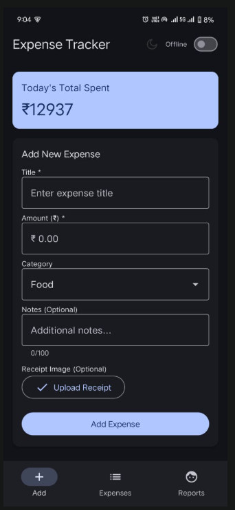
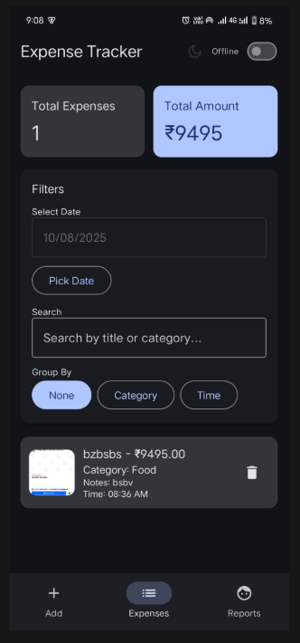
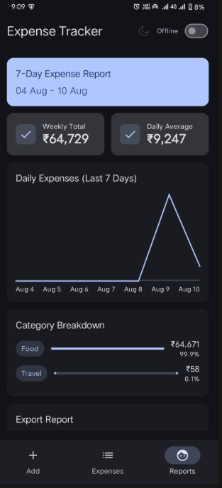
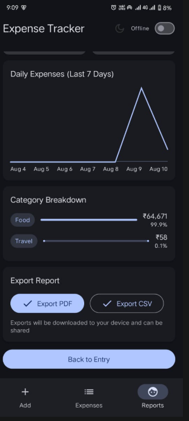
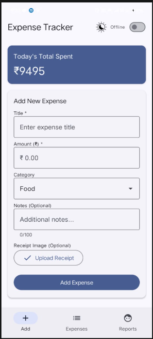
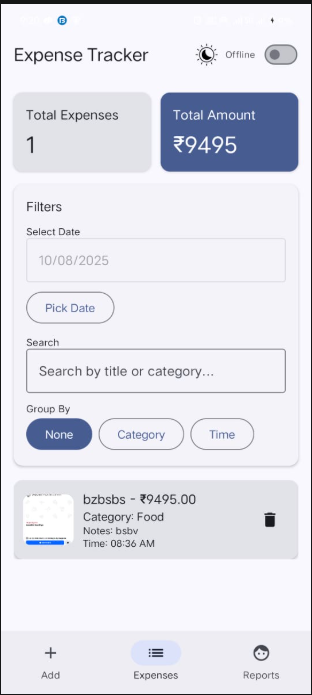
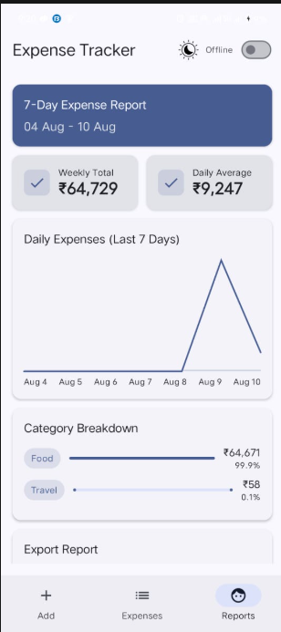
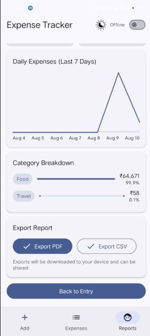

# 📊 Smart Daily Expense Tracker

A **Jetpack Compose** Android application tailored for small business owners to **record, view, and analyze daily expenses** with ease.  
Designed to prevent loss of expense data, it offers a **minimal interface**, **instant totals**, **reports**, and **theme switching**.

---
## 📸 Screenshots

| Entry Screen (Dark) | Expenses List (Dark) | Report (Dark 1) | Report (Dark 2) |
|---------------------|----------------------|-----------------|-----------------|
|  |  |  |  |

| Entry Screen (Light) | Expenses List (Light) | Report (Light 1) | Report (Light 2) |
|----------------------|-----------------------|------------------|------------------|
|  |  |  |  |
---


## 🤖 AI Assistance Summary

This project was built using AI-assisted workflows with **ChatGPT** and **GitHub Copilot** and **Cusrsor**.

AI was used for:
- Generating boilerplate Jetpack Compose code for screens and navigation.
- Structuring MVVM architecture with ViewModel logic.
- Suggesting repository patterns and state management best practices.
- Debugging image resource issues, navigation bugs, and preview errors.

---

## 💬 Key Development Prompts

> **Persistent UI Element Design** – "Create an AI-driven Jetpack Compose layout with a fixed top app bar across all navigations, integrating a theme switcher aligned to the right."

> **Full Project Generation** – "Develop a complete Jetpack Compose-based ‘Smart Daily Expense Tracker’ app using MVVM architecture, ensuring clean code separation, modularity, and best practices."

> **Architecture Review & Optimization** – "Evaluate my existing Android project folder structure for MVVM adherence and recommend improvements for scalability, maintainability, and readability."


## ✅ Features Checklist

### Core Screens & Flows
- [x] **Expense Entry Screen** — Title, Amount, Category, Notes, Receipt Image, Submit Button, Total Today.
- [x] **Expense List Screen** — Today’s expenses, Date filter, Grouping, Totals, Empty state.
- [x] **Expense Report Screen** — Last 7 days mock report, Category totals, Chart.
- [x] **Navigation** — Bottom Navigation with Navigation Compose.

### State & Data Layer
- [x] MVVM architecture with ViewModel + StateFlow.
- [x] In-memory repository (Room optional).
- [x] Real-time state updates.

### Bonus Features
- [x] Theme Switcher (Light/Dark mode).
- [x] Local persistence with Datastore (optional).
- [x] Animation when adding an expense.
- [x] Basic input validation.

---

## 📦 Build & Run Instructions

**Prerequisites:**
- Android Studio **Bumblebee** or later.
- Kotlin + Jetpack Compose environment configured.

**Steps:**
```bash
# 1. Clone the repository
git clone <https://github.com/DebasisPaltu/SmartExpenseTracker>
cd SmartExpenseTracker
# 2. Open the project in Android Studio
# 3. Build & run on emulator or physical device
